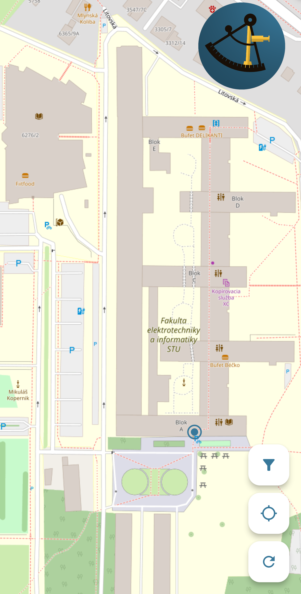

# SpoofGuard Navigator

Flutter app for **detecting GNSS spoofing and interference** using IMU sensor fusion with GNSS data.

## Version
v1.0.0 (2024-05-28)

## Contact
**Michal Holienčík** 
e-mail: mholiencik@proton.me

